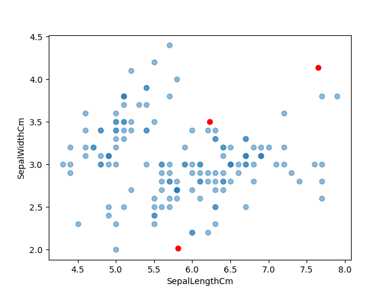
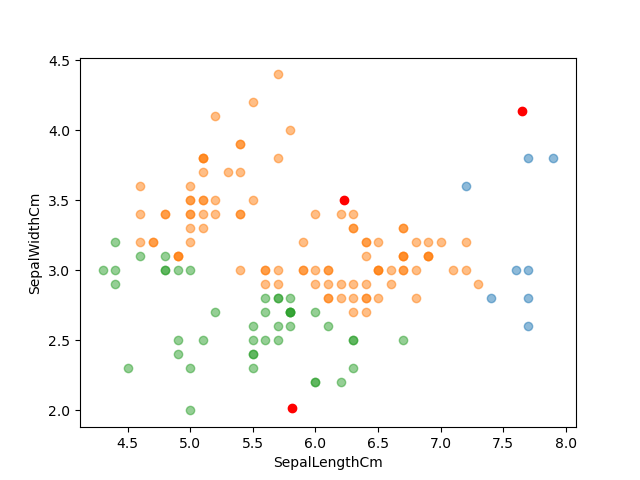
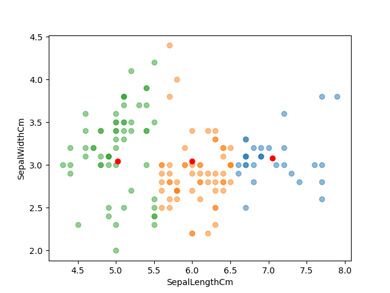
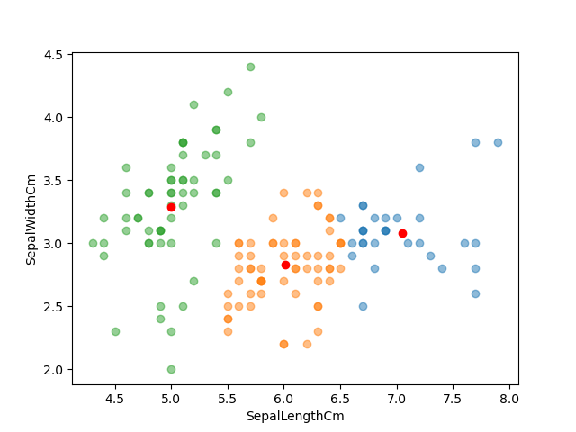

# 📍 K-means-with-numpy

A from-scratch implementation of the **K-Means Clustering** algorithm using **NumPy** and **Pandas**. This project demonstrates the iterative process of centroid initialization, distance calculation, and cluster assignment using the classic Iris dataset.

---

## 🎯 Study Goals
- **Algorithm Logic**: Implement the core K-Means logic: Centroid initialization → Assignment → Update.
- **Distance Metrics**: Apply **L2 Distance (Euclidean Distance)** to determine the proximity between data points and centroids.
- **Data Visualization**: Visualize the movement of centroids and the formation of clusters at each iteration using Matplotlib.

---

## 🔬 Implementation Details

### 1. Preprocessing & Initialization
- **`preprocessing()`**: Loads the Iris dataset, shuffles the data for randomness, and selects key features for clustering.
- **`centroid_init_randomly()`**: Initializes K centroids at random positions within the feature space range.

### 2. Assignment & Update Loop
- **`L2_distance()`**: Calculates the Euclidean distance between points and centroids.
- **`closest()`**: Assigns each data point to the nearest centroid.
- **Centroid Update**: Recalculates the position of each centroid by taking the **mean** of all points assigned to that cluster.

### 3. Iterative Visualization
- The script runs for a set number of iterations (e.g., 10), plotting the clusters and centroids at each step to show the convergence of the algorithm.

---

## 🛠 Tech Stack
- **Language**: Python 3.x
- **Data Manipulation**: NumPy, Pandas
- **Visualization**: Matplotlib
- **Dataset**: Iris Dataset (SepalLengthCm, SepalWidthCm)

---

## 📂 Project Structure
- `kmeans_scratch.py`: Main script containing the algorithm implementation and visualization logic.
- `iris.csv`: Dataset used for clustering experiments.

---

## 📊 How to Run
1. Ensure `iris.csv` is in the project directory.
2. Run the script:
   ```bash
   python main.py


## Concept

* https://en.wikipedia.org/wiki/K-means_clustering

## Dataset
* Iris 

## My result







